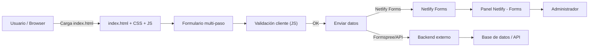

# 👑 FI Royale - Portal de Inscripción y Torneos

[]()
[]()

**FI Royale** es una interfaz web temática para gestionar inscripciones a torneos de *Clash Royale*. Este README ha sido corregido y estructurado para facilitar la lectura, instalación y despliegue del proyecto.

---

## 📋 Contenido

- [Descripción](#descripción)
- [Características](#características)
- [Tecnologías](#tecnologías)
- [Estructura del proyecto](#estructura-del-proyecto)
- [Instalación y uso local](#instalación-y-uso-local)
- [Configuración del formulario](#configuración-del-formulario)
- [Personalización y estilos](#personalización-y-estilos)
- [Lógica de JavaScript](#lógica-de-javascript)
- [Despliegue](#despliegue)
- [Contribuir](#contribuir)
- [Autores y contacto](#autores-y-contacto)

---

## 📝 Descripción

FI Royale Registration es una *single page* (conceptual) que reemplaza formularios genéricos por una experiencia gamificada para aumentar la conversión de inscripciones. Incluye un formulario multi‑paso con validación en el cliente, micro-interacciones y redirección a comunidades (Discord) tras el registro.

---

## ✨ Características principales

- Formulario multi‑paso con validación en tiempo real.
- Diseño responsivo (Mobile‑First).
- Barra de progreso dinámica y micro‑interacciones.
- Integración preparada para Netlify Forms.
- Redirección automática a Discord / páginas de confirmación.
- Configuración visual por variables CSS (theming).

---

## 🛠 Tecnologías utilizadas

- HTML5 semántico
- CSS3 (Flexbox / Grid / Variables)
- JavaScript (ES6+)
- FontAwesome (CDN)
- Google Fonts

---

## 🗂 Estructura del proyecto

```
fi-royale-web/
│
├── index.html              # Página principal (Formulario de Inscripción)
├── css/
│   └── style.css           # Hoja de estilos principal
├── js/
│   └── ux-improvements.js  # Lógica del formulario y validaciones
├── pages/
│   └── reglas.html         # Reglamento del torneo
├── img/                    # Activos gráficos (Hero, fondo, favicon)
└── README.md               # Documentación del proyecto
```

---

## 🧭 Arquitectura (diagrama)

A continuación un diagrama Mermaid que se renderiza en GitHub si el repo lo permite:



---

## 💻 Instalación y uso local

Sigue estos pasos para ejecutar localmente:

1. Clonar el repositorio:
```bash
git clone https://github.com/tu-usuario/fi-royale-web.git
cd fi-royale-web
```

2. Preparar recursos gráficos:
- Coloca las imágenes requeridas dentro de `img/` (`Hero.png`, `fondo.png`, favicon, etc.)

3. Ejecutar localmente (opciones):
- Abrir `index.html` directamente en el navegador (modo estático), **o**
- Servir con Live Server (VS Code) para hot-reload:
```bash
# Si tienes instalado live-server (npm)
live-server
```

> Recomendación: usar la extensión **Live Server** de VS Code para simular un servidor y ver cambios en tiempo real.

---

## ⚙️ Configuración del formulario

### Opción A — Netlify (recomendado para deploy rápido)
El `index.html` puede incluir:
```html
<form method="POST" id="epicForm" data-netlify="true" netlify-honeypot="bot-field">
  <input type="hidden" name="form-name" value="epicForm" />
  <!-- campos -->
</form>
```
Netlify detectará automáticamente el formulario al hacer deploy.

### Opción B — Formspree u otro backend
Cambia el atributo `action` en el `<form>`:
```html
<form action="https://formspree.io/f/TU_ID_AQUI" method="POST" id="epicForm">
  <!-- campos -->
</form>
```
Si usas fetch en JavaScript, ajusta la URL y las cabeceras según la API.

---

## 🎨 Personalización (theming)

El proyecto usa variables CSS en `:root`. Ejemplo:
```css
:root{
  --bg: #1a263a;
  --accent: #ff4081;
  --gold: #f7c55c;
  --text: #ffffff;
}
```
Cambia estas variables para modificar rápidamente el skin visual del sitio.

---

## 📜 Lógica de JavaScript (resumen)

`js/ux-improvements.js` contiene:
- Gestión de pasos (`showStep(index)`).
- Validación por paso (`validateStep(index)`).
- Envío asincrónico y manejo de respuesta (`fetch()`).
- Actualización visual de la barra de progreso.

---

## 🚀 Despliegue

**Netlify** (recomendado):
1. Subir el repo a GitHub.
2. En Netlify: New site > Import from Git > seleccionar repo.
3. El formulario funcionará automáticamente gracias a `data-netlify="true"`.

**GitHub Pages / Vercel**:
- Son adecuados para hosting estático, pero necesitarás un servicio externo para procesar el formulario (Formspree, Zapier, etc.).

---

## 🤝 Cómo contribuir

1. Fork del repo.
2. Crear rama: `git checkout -b feature/tu-cambio`
3. Commit: `git commit -m "Descripción del cambio"`
4. Push y abrir Pull Request.

---

## 📬 Contacto

**Equipo FI Royale**  
Email: clashtournament75@gmail.com  
Instagram: https://www.instagram.com/fi_royale/  
Discord: https://discord.gg/Vnphm9s3

---
